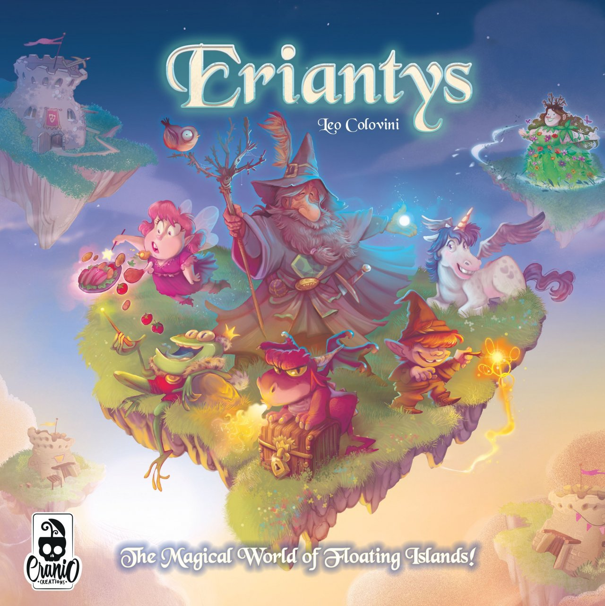

# Software Engineering Project: Eriantys Board Game



The goal of the project was to implement the board game [Eriantys](https://www.craniocreations.it/prodotto/eriantys) as a client-server based Java program.
The implementation net us a score of 30/30.

## How to play
### Requirements
- Java 17
- Maven 3+

### Play with the CLI
1. First, clone this repository:
  
   ```shell
   git clone https://github.com/PierLuigiPorri/ing-sw-2022-pellegrino-porri-perico
   cd ing-sw-2022-pellegrino-porri-perico
   ```

2. Then, move to the 'deliverables' folder and start the server:
   
   ```shell
   java -jar Eriantys-GC56-Server.jar
   ```
   
3. Finally, start the client:

   ```shell
   java -jar Eriantys-GC56-CLI.jar
   ```
### Play with the GUI

Follow the above process through step 2, then start the GUI client:

   ```shell
   java -jar Eriantys-GC56-GUI.jar
   ```
Or double-click the same file.
